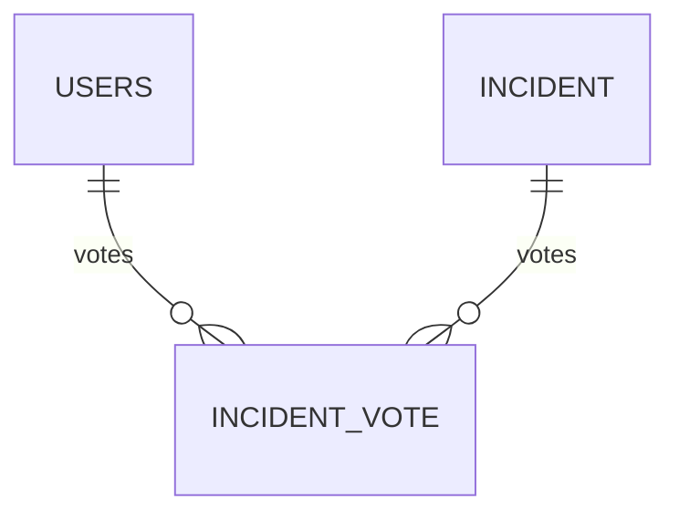

# Documentation technique

## 1. Vue d’ensemble

| Couche                | Proto/Port | Description                                      |
|-----------------------|------------|--------------------------------------------------|
| Gateway Nginx (prod)  | 80 / 443   | Terminaison TLS + routage Web/Mobile             |
| **API NestJS**        | 3000 / 3443| REST, WebSocket (Socket.IO), tâches CRON         |
| PostgreSQL + PostGIS  | 5432       | L1 stockage incidents & utilisateurs             |
| CRON clean-expired    | –          | Archive incidents > 4 h toutes les 30 min        |

## 2. Sécurité

* **OAuth2** via `passport-google-oauth20`.
* **JWT** access 1 h / refresh 7 j – hashé en base pour révocation.
* **CSRF** : cookie `XSRF-TOKEN` + en-tête `X-CSRF-Token`.
* **XSS / SQLi** : `class-sanitizer`, requêtes paramétrées TypeORM.
* **Chiffrement** : colonne AES-256 (e-mails, IDs OAuth).

## 3. Base de données

* **Geometry** : `incident.location` (`Point`, SRID 4326) + index GIST.

## 4. API principales

| Méthode | Endpoint                         | Auth | Description                        |
|---------|----------------------------------|------|------------------------------------|
| POST    | `/auth/login | register`         | –    | JWT (+refresh)                     |
| POST    | `/incidents`                    | JWT  | Création d’incident                |
| PATCH   | `/incidents/:id/(confirm|deny)` | JWT  | Vote utilisateur                   |
| GET     | `/navigation/calculate`         | –    | Itinéraires multiples, toll toggle |
| WS      | `incidentAlert`                 | JWT  | Push incident temps-réel           |

*Voir Swagger pour le détail.*

## 5. WebSocket – filtrage géospatial

1. Le front envoie `subscribeRoute` avec `Feature<LineString>`.
2. Le backend garde `{route, threshold}` par socket.
3. Chaque nouveau **incident** → test Turf `pointToLineDistance` → push ciblé.

---

## 6. Stack front

| Côté | Libs clés                  |
|------|---------------------------|
| Web  | React 18, React-Router v7, Leaflet, Recharts |
| Mobile | Expo SDK 52, react-native-maps, expo-camera |

---

## 7. Tests

* **unit** Nest (+Jest) – 100 % services critiques.
* **e2e** Supertest – auth, incidents, navigation, stats.